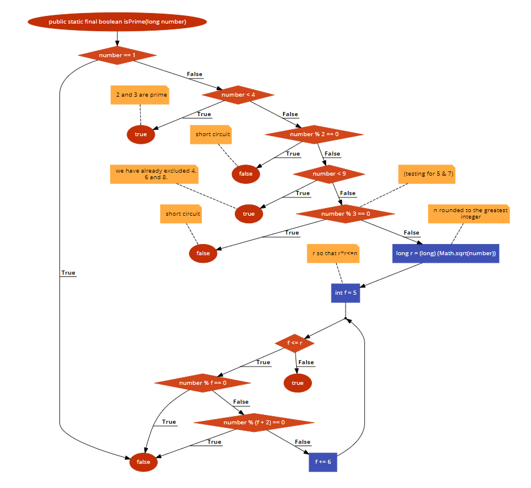

# Bài tập kiểm thử
- Họ và tên: Đỗ Ngọc Duy
- MSV: 16020216
- Lớp: K61-CA-CLC1
## Hàm đã chọn
- link : https://github.com/phishman3579/java-algorithms-implementation/blob/master/src/com/jwetherell/algorithms/mathematics/Primes.java
```sh
1 public static final boolean isPrime(long number) {
2        if (number == 1)
3            return false;
4        if (number < 4)
5            return true; // 2 and 3 are prime
6        if (number % 2 == 0)
7            return false; // short circuit
8        if (number < 9)
9            return true; // we have already excluded 4, 6 and 8.
10        // (testing for 5 & 7)
11       if (number % 3 == 0)
12            return false; // short circuit
13        long r = (long) (Math.sqrt(number)); // n rounded to the greatest integer
14        // r so that r*r<=n
15        int f = 5;
16        while (f <= r) {
17            if (number % f == 0)
18                return false;
19            if (number % (f + 2) == 0)
20                return false;
21            f += 6;
22        }
23        return true;
24    }
```

### 1. Flowchart


### 2. List of Road

#### Road 1: 1 &rarr; 2 &rarr; 3 &rarr; 4 &rarr; 5 &rarr; 11 &rarr; 3 &rarr; 17 &rarr; 18
#### Road 2: 1 &rarr; 2 &rarr; 3 &rarr; 4 &rarr; 5 &rarr; 6 &rarr; 11 &rarr; 12 &rarr; 3 &rarr; 17 &rarr; 18 
#### Road 3: 1 &rarr; 2 &rarr; 3 &rarr; 4 &rarr; 5 &rarr; 6 &rarr; 7 &rarr; 8 &rarr; 11 &rarr; 12 &rarr; 3 &rarr; 17 &rarr; 18
#### Road 4: 1 &rarr; 2 &rarr; 3 &rarr; 4 &rarr; 5 &rarr; 6 &rarr; 11 &rarr; 12 &rarr; 13 &rarr; 14 &rarr; 3 &rarr; 17 &rarr; 18
#### Road 5: 1 &rarr; 2 &rarr; 3 &rarr; 4 &rarr; 5 &rarr; 6 &rarr; 7 &rarr; 8 &rarr; 11 &rarr; 12 &rarr; 13 &rarr; 14 &rarr; 3 &rarr; 17 &rarr; 18


### 3. Path Conditions

#### Path 1: size <= 1
#### Path 2: size > 1, array already sorted
#### Path 3: size > 1, only odd positions don't sorted
#### Path 4: size > 1, only even positions don't sorted
#### Path 5: size > 1, array doesn't sorted

### 4. Generate Test Case

#### Path 1: n = 0, a[ ] = { }
#### Path 2: n = 5, a[ ] = {2, 15, 18, 53, 74}
#### Path 3: n = 6, a[ ] = {17, 2, 89, 5, 10, 12}
#### Path 4: n = 9, a[ ] = {2, 41, 12, 7, 53, 51, 74, 45, 99}
#### Path 5: n = 7, a[ ] = {89, 14, 52, 0, 16, 75, 45}

### 5. Expected Output
	
#### Path 1: Nothing to print
#### Path 2: 2, 15, 18, 53, 74
#### Path 3: 2, 5, 10, 12, 17, 89
#### Path 4: 2, 7, 12, 41, 45, 51, 53, 74, 99
#### Path 5: 0, 14, 16, 45, 53, 75, 89