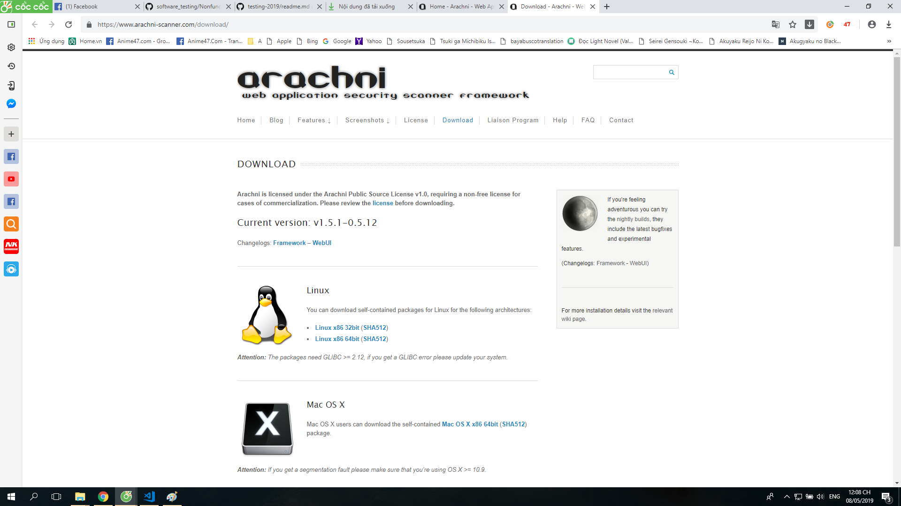
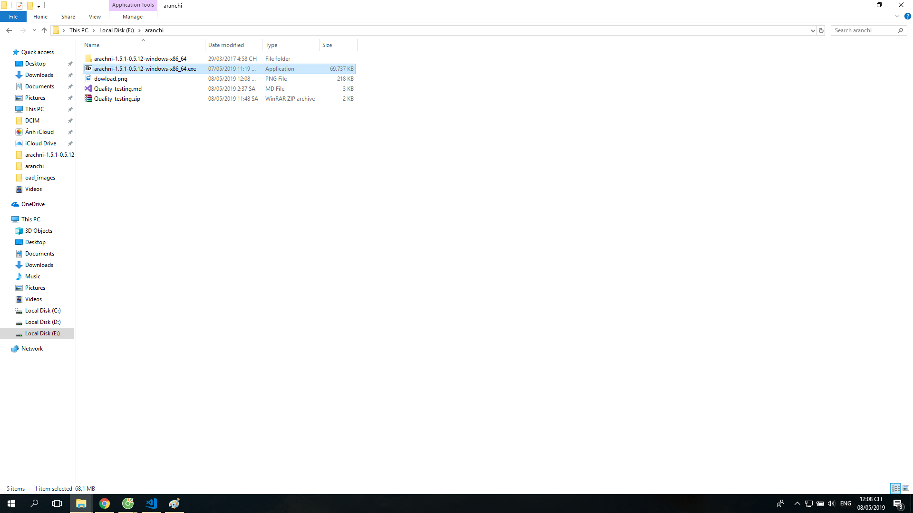
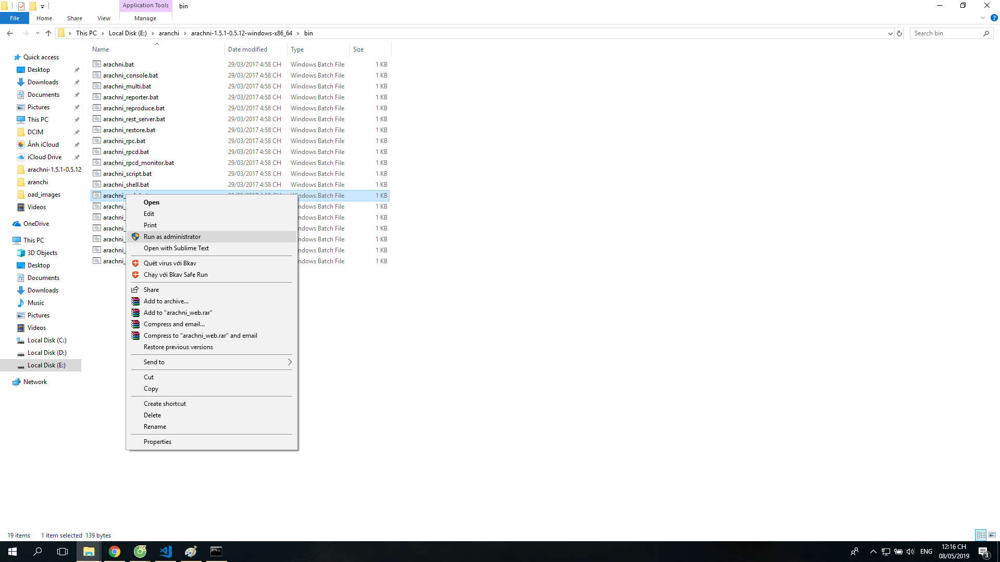
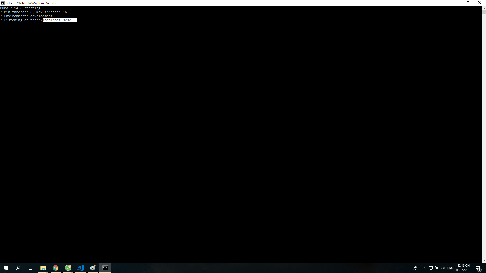
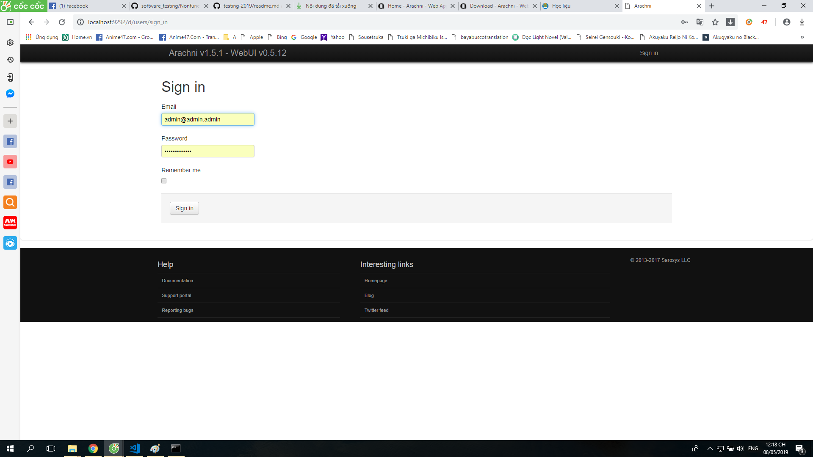
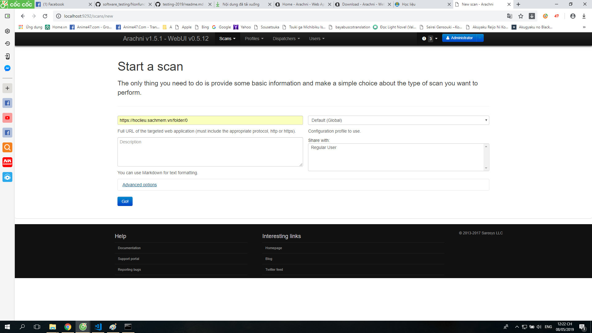
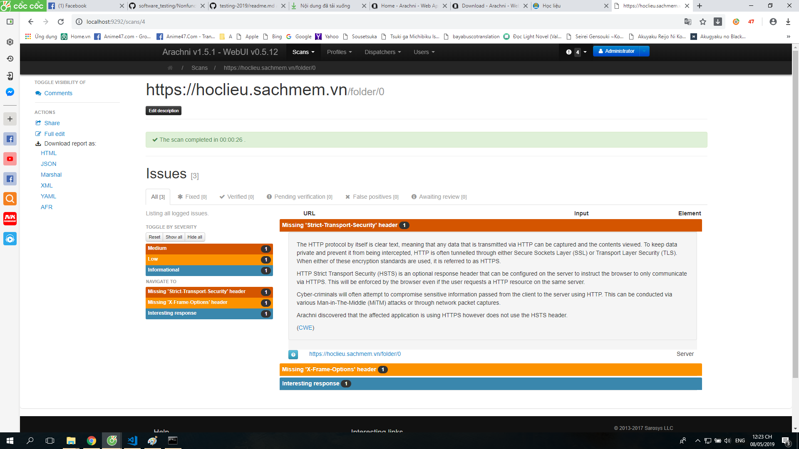
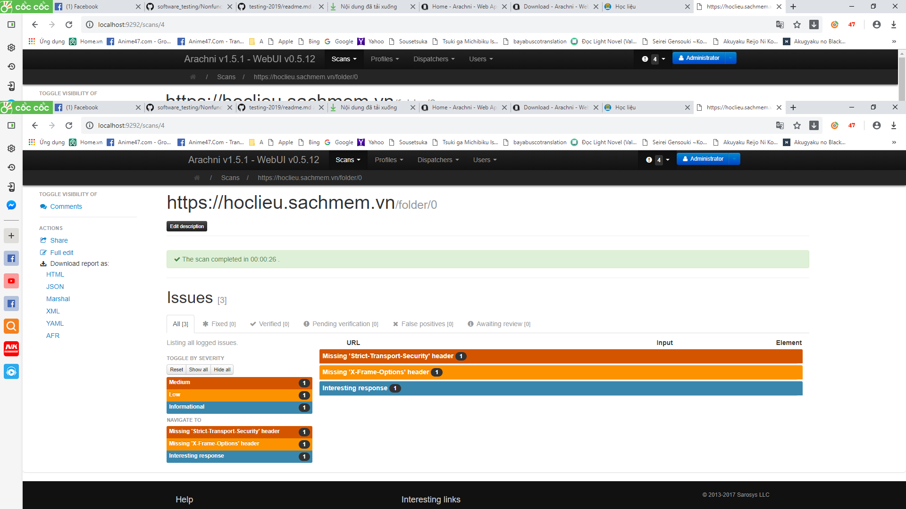

# Báo cáo các công cụ kiểm thử chất lượng hệ thống
## Nhóm 36:
- Đỗ Ngọc Duy
- Đồng Việt Hoàng
- Nguyễn Trường Giang
- Phạm Văn Đại

# Công cụ Arachni
*    Arachni is a feature-full, modular, high-performance Ruby framework aimed towards helping             penetration testers and administrators evaluate the security of web applications. 

*    It is smart, it trains itself by monitoring and learning from the web application's behavior during the scan process and is able to perform meta-analysis using a number of factors in order to correctly assess the trustworthiness of results and intelligently identify (or avoid) false-positives.

*    Unlike other scanners, it takes into account the dynamic nature of web applications, can detect changes caused while travelling through the paths of a web application’s cyclomatic complexity and is able to adjust itself accordingly. This way, attack/input vectors that would otherwise be undetectable by non-humans can be handled seamlessly.

*    Moreover, due to its integrated browser environment, it can also audit and inspect client-side code, as well as support highly complicated web applications which make heavy use of technologies such as JavaScript, HTML5, DOM manipulation and AJAX.

*    Finally, it is versatile enough to cover a great deal of use cases, ranging from a simple command line scanner utility, to a global high performance grid of scanners, to a Ruby library allowing for scripted audits, to a multi-user multi-scan web collaboration platform.

## Cách cài đặt Arachni
### 1. Vào trang web chứa công cụ
```
https://www.arachni-scanner.com/
```

### 2. Dowload phiên bản phù hợp với hệ điều hành của máy tính
 

### 3. Giải nén File vừa dowload
*    click đúp chuột vào file cần dowload


*    sau khi quá trình giải nén thành công là bạn đã cài đặt xong Arachni

## Test với https://hoclieu.sachmem.vn/folder/0
### 1.Khởi động Arachni
*    Vào thư mục vừa đưuọc giải nén chọn bin và chạy file arachni_web.bat dưới quyền quản trị



### 2. Đăng nhập và bắt đầu test
*    Mở trình duyệt và truy cập vào server arachni đã tạo



*    Đăng nhập vào bằng tài khoản admin.Tài khoản có thể tìm thấy đc ở file README.txt



*    Sau khi đăng nhập xong để bắt đầu Test ta chọn Scan rồi chọn new.Cuối cùng ta chỉ việc nhập URL của trang web cần test vào.



### 3.Kết quả test
*    Sau khi test xong Arachni trả về kết quả test theo các mức độ nghiêm trọng theo tiêu chuẩn của CWE



### 4.Get file 
*    Chúng ta có thể get file review này dưới các dạng HTML, JSON, MARSHAL, XML, YAML, AFR



##Lỗi tìm được
### 1. Missing "Stric-Transport-Security" header - medium
*    The HTTP protocol by itself is clear text, meaning that any data that is transmitted via HTTP can be captured and the contents viewed. To keep data private and prevent it from being intercepted, HTTP is often tunnelled through either Secure Sockets Layer (SSL) or Transport Layer Security (TLS). When either of these encryption standards are used, it is referred to as HTTPS.

*    HTTP Strict Transport Security (HSTS) is an optional response header that can be configured on the server to instruct the browser to only communicate via HTTPS. This will be enforced by the browser even if the user requests a HTTP resource on the same server.

*    Cyber-criminals will often attempt to compromise sensitive information passed from the client to the server using HTTP. This can be conducted via various Man-in-The-Middle (MiTM) attacks or through network packet captures.

*    Arachni discovered that the affected application is using HTTPS however does not use the HSTS header.
*    (CWE)
### 2. Missing "X-Frame-Options" header - low

*	Clickjacking (User Interface redress attack, UI redress attack, UI redressing) is a malicious technique of tricking a Web user into clicking on something different from what the user perceives they are clicking on, thus potentially revealing confidential information or taking control of their computer while clicking on seemingly innocuous web pages.

*    The server didn’t return an X-Frame-Options header which means that this website could be at risk of a clickjacking attack.

*    The X-Frame-Options HTTP response header can be used to indicate whether or not a browser should be allowed to render a page inside a frame or iframe. Sites can use this to avoid clickjacking attacks, by ensuring that their content is not embedded into other sites.
*    (CWE)

### 3. Interesting response - infomational

*    The server responded with a non 200 (OK) nor 404 (Not Found) status code. This is a non-issue, however exotic HTTP response status codes can provide useful insights into the behavior of the web application and assist with the penetration test.

