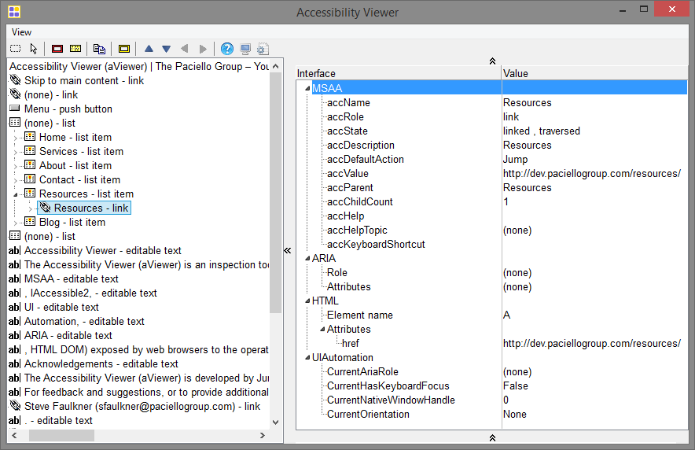
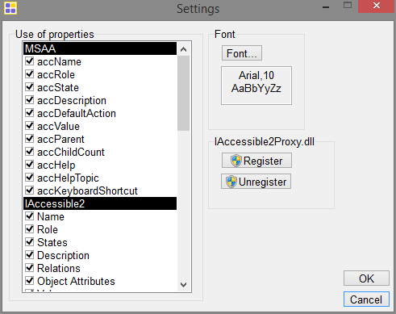
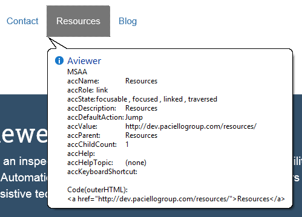

ACCESSIBILITY VIEWER
=================
* Accessibility Viewer is developed by Jun and Steve Faulkner (The Paciello Group, Europe), with support from Hans Hillen, Gez Lemon (The Paciello Group, Europe), and Google
* Also known as aViewer
* The Accessibility Viewer (aViewer) is an inspection tool for Windows that displays the accessibility API information (MSAA, IAccessible2, UI Automation, ARIA, HTML DOM) exposed by web browsers to the operating system, and thus to any assistive technology (AT) such as screenreaders

* The accessibility information includes IAccessible2, MSAA, UI Automation, HTML DOM, and ARIA
  
* The Accessibility Inspector also includes the ability to navigate the Accessibility tree hierarchy using visible buttons or keyboard commands. While holding the Control and Command keys, use the arrow keys to navigate. The up and down arrows navigate to parents or children, and the left and right arrows navigate to siblings of the current element

* The program assists by displaying information within the web pages, and it automatically checks single web pages. The supported format is HTML and the product is an online service. Unlike many other web accessibility programs, aViewer is also a free license software program

-------------------
# Accessibility Viewer UI

* *aViewer main window*

* *aViewer settings*

* *aViewer in-browser tooltip*

## Source
[Download](https://developer.paciellogroup.com/resources/aviewer/)
(Only work with Windowns)

## Youtube Tutorial
[Watch](https://www.youtube.com/watch?v=dqcx0_TkHbw) - aViewer intro