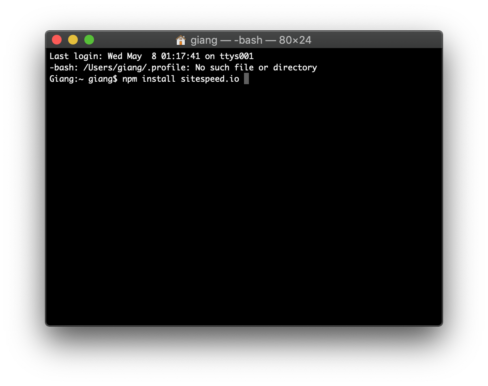

# Hướng dẫn dùng sitespeed.io cơ bản

video hướng dẫn :https://youtu.be/ZTLUolCGHK0

## 1. Giới thiệu công cụ 

Sitespeed.io là một công ục kiểm thử performance của website, với cách cài đặt và dùng đơn giản thông qua các dòng lệnh và reportlaf các thong số trực quan dễ nhìn, đánh giá theo thang điểm 100.

## 2. Cài đặt

cài đặt qua cmd

'''npm install -g sitespeed.io'''

sitespeed sẽ tự đọng được tải về và cài đặt 

## 3. Hướng dẫn test cơ bản 

Mặc định sitespeed sẽ dùng chrome và test 3 lần liên tiếp 

các bạn gõ lệnh :'''sitespeed.io https://hoclieu.sachmem.vn/'''

## 4. Kết Quả
Kết quả chung 

Overall là điểm kết hợp giữa hiệu năng, khả năng truy cập, số điểm theo thang điểm 100 càng cao càng tốt
và nó còn cho ra thời gian load trang trung bình, ở đây là khoảng 2 giây và thời gian server tạo và gửi file HTML...
